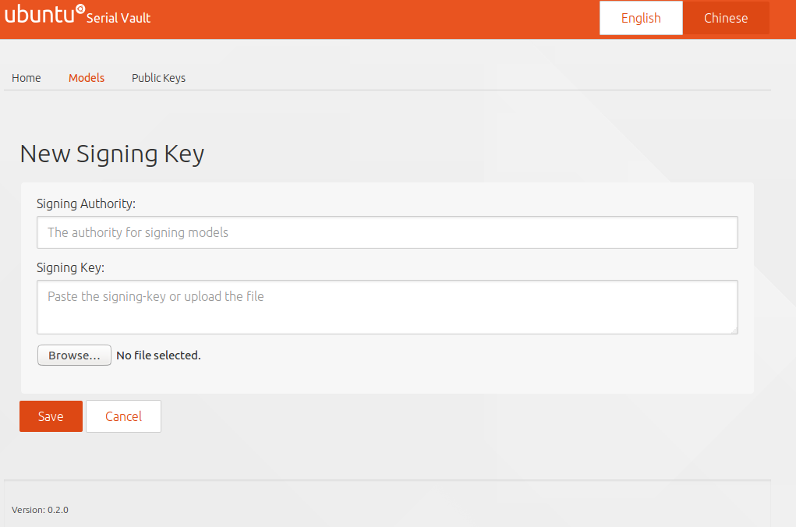
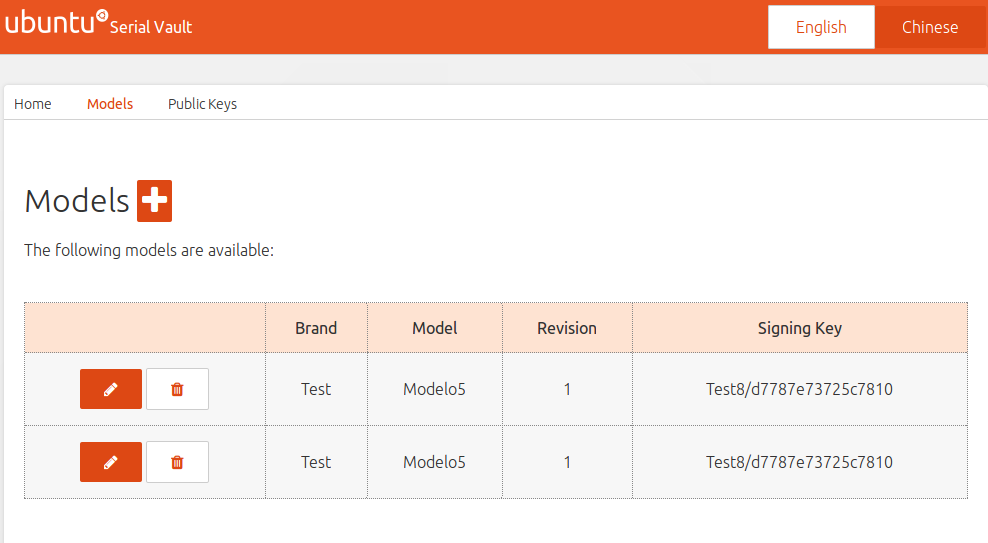
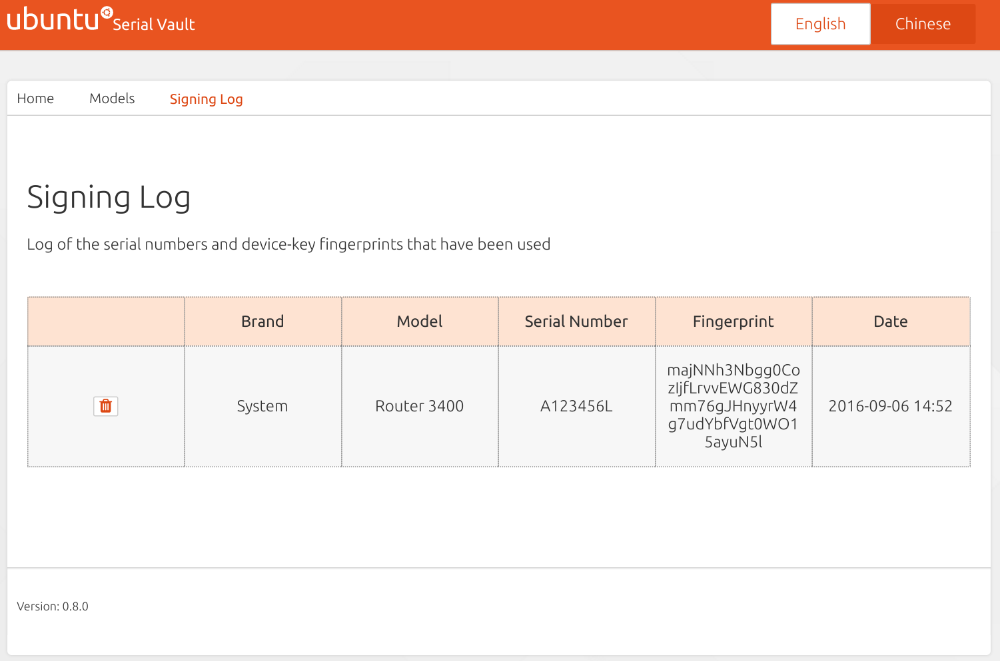

# Overview

The SerialVault will need to be configured for use at the factory. The prime function will be
 addition of new models and associating a signing key for each model. The signing keys will 
 be stored securely in the database using multi-stage encryption. Other information related to 
 models and their keys will also be stored in a database that will be accessed by REST API.

The configuration will be handled by a web user interface that will be accessible only from 
the data centre. The following functionality will be provided by the web user interface:

 * Adding new private keys and activate/deactivate them
 * Adding a new model and its signing key
 * Revoking a model
 * Listing supported models
 * Displaying the Signing Log of serial numbers and device-keys that have been signed
 * Deleting entries from the Signing Log
 * Displaying the version of the SerialVault

# Adding a new private signing key

| Input Element     | Description                                |
|-------------------|--------------------------------------------|
| Signing Authority | the name of the authority owner of the key |
| Signing Key:      | the private signing PGP key                |

## Actions

The uploaded Signing Key is validated and undergoes multi-stage encryption, optionally using 
the TPM module, and stored within the database. On first use, the Signing Key is decrypted and 
added to a memory store.

## UI Example:

# Adding a new model

| Input Element     | Description                                                                                        |
|-------------------|----------------------------------------------------------------------------------------------------|
| Brand ID          | the account ID of the brand                                                                        |
| Model:            | the model name of the device                                                                       |
| API Key           | the key to be used in the header for requesting to sign serial assertion for this branch and model |
| Signing Key       | a reference to an active signing key                                                               |

## Actions

The model data will be stored in the local database storage, along with the reference to the 
signing key. When an API request is received for the model, the model data and the relevant 
signing key can be retrieved.

## UI Example:

# Revoking a key

If a signing key becomes compromised, it may be necessary to revoke it. This will need to 
happen in the Serial Vault as well as the snappy stores.

# Listing Supported Models

Providing a method to display the models that are supported for signing by the SerialVault.
Details of the signing key will not be shown.

## UI Example:

# Displaying the Signing Log

The Signing Log displays the list of serial numbers and device keys that have been used to sign assertions. 
The display also provides a facility to allow an entry to be deleted, which may be useful if a device needs 
to be provisioned again.

## UI Example

# Display the version of the Serial Vault

Whilst this does not need to be a specific function, the version of the SerialVault will be displayed 
on the main user interface pages.
