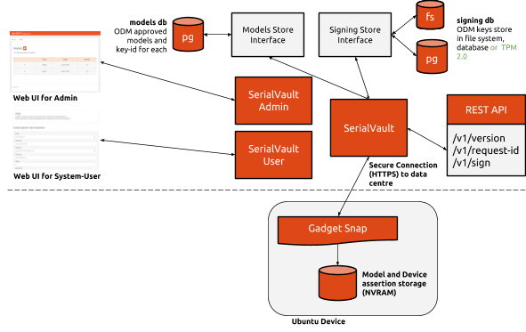
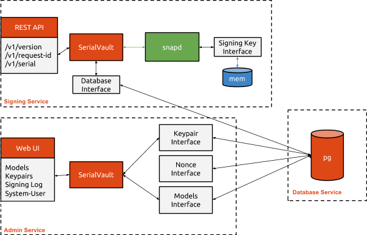

# Overview

The SerialVault is comprised of three services, deployed at a data centre:

* Signing Service
* Admin Service

The Signing Service is the publicly accessible service that is used to generate a 
signed serial assertion using a predefined signing key. The Admin Service is a private 
service, that is designed to be accessible only from the data centre, that allows 
signing keys and models to be defined.

# Design

The Signing Service provides two main methods: one to generate a nonce (/request-id) 
and the serial method (/serial). Before calling the sign method, a nonce will need to be 
generated and included in the serial-request assertion that is sent to the sign method. 
The sign method validates the nonce, checks that the model is a recognised one, generates 
a serial assertion and then signs and returns a serial assertion.

The sign method accesses the Signing Key from the memory store. The first time a Signing 
Key is used, it will be retrieved from the database, decrypted and added to the memory store.

The Admin Service allows signing keys to be uploaded, and for models to be defined. Whenever 
a valid sign request is made, the serial number and device-key fingerprint are stored in the 
database. The Admin Service provides a Signing Log view that shows the valid serial number 
and device-keys fingerprints that have been used.

